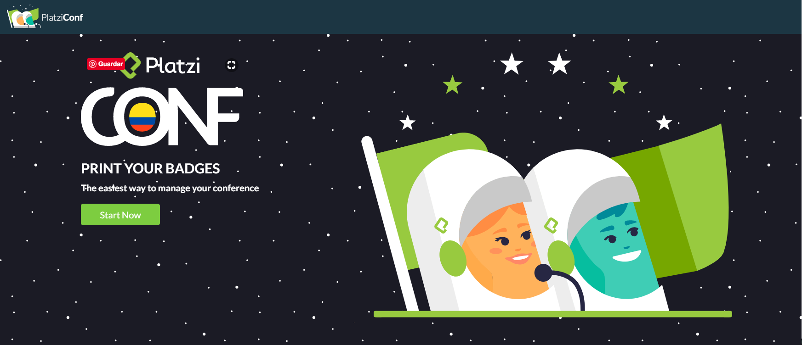
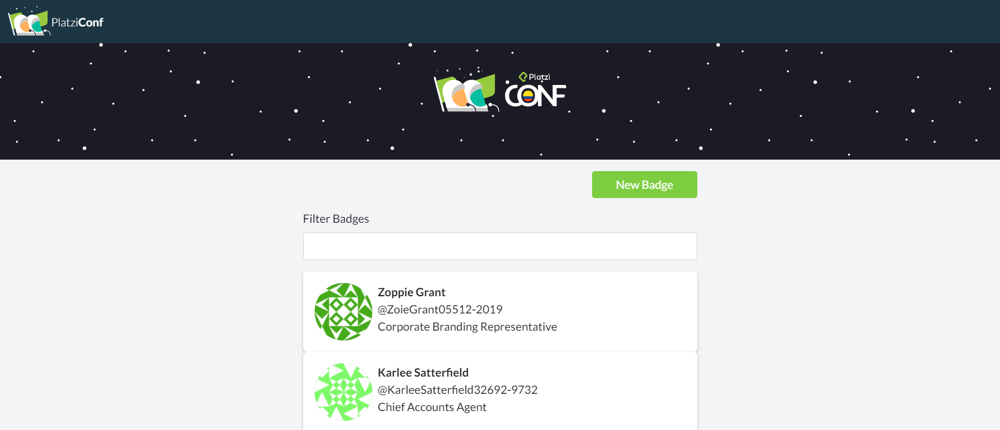
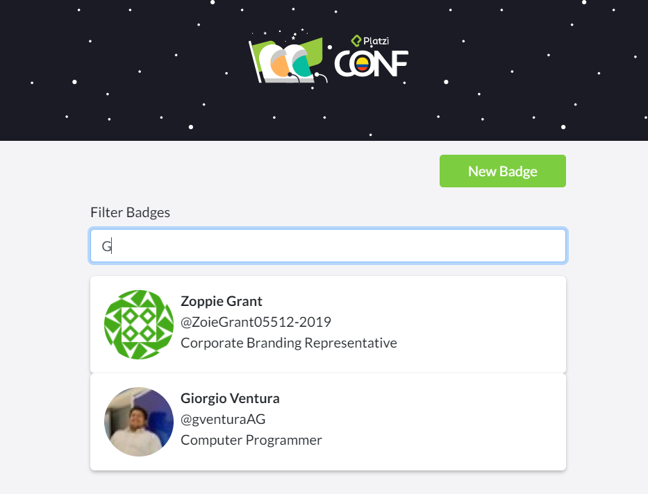
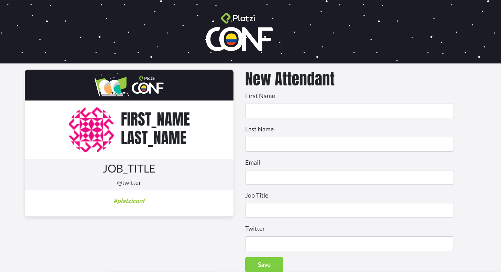
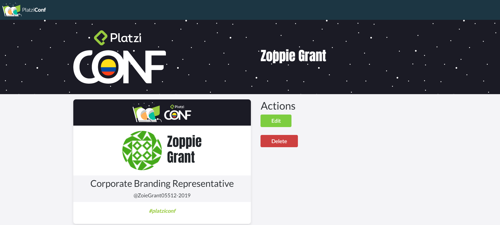

# App de Platzi Conf

Esta App se encarga de registar a todos los participantes a la platzi conf 2019. Su principal utilidad es aprender React JS.

## Cómo funciona?

Requiere Node.JS

* `npm install` para instalar las dependencias.
* `npm run start` para el entorno de desarrollo.
* `npm run build && npm start` para el entorno de producción.

## Licencia

MIT